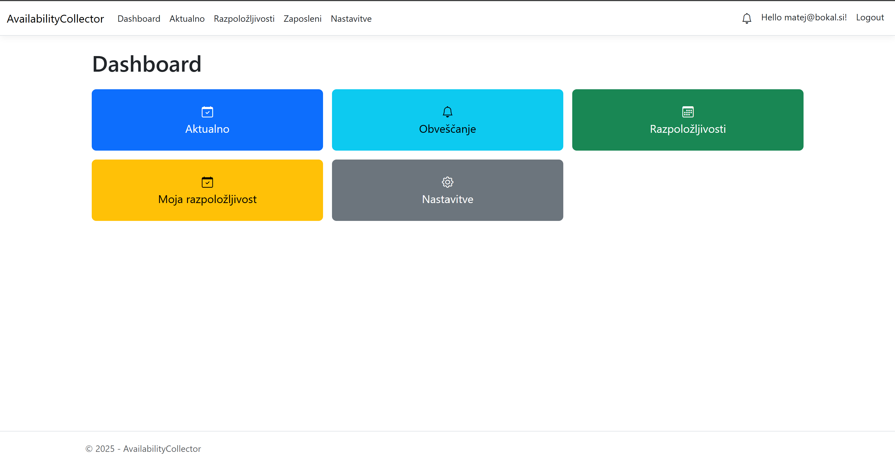
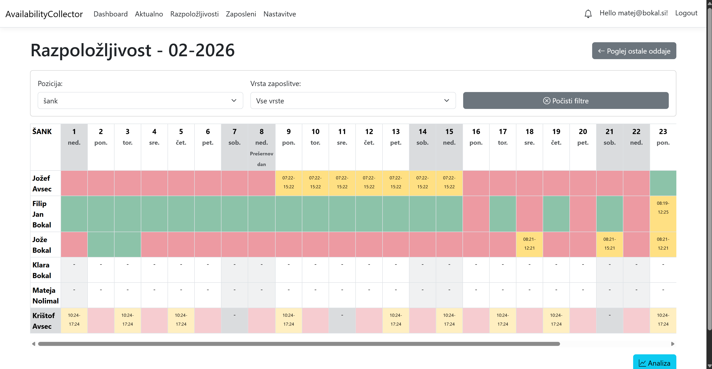
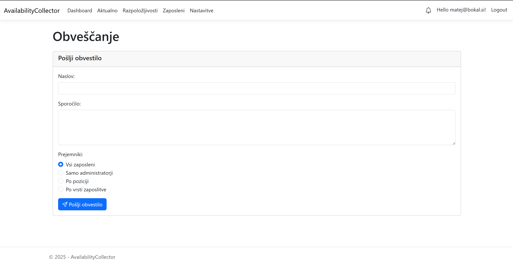
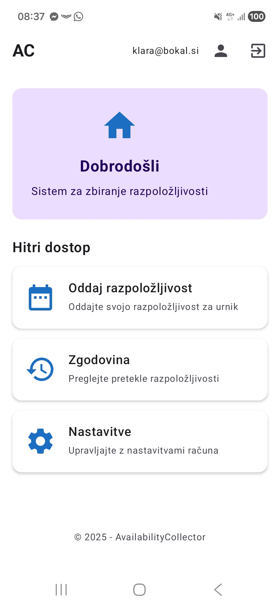
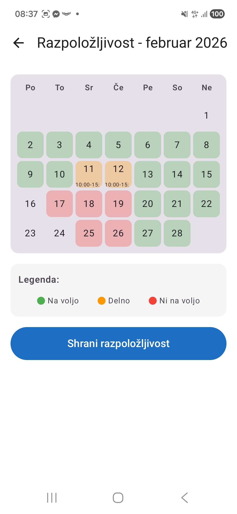
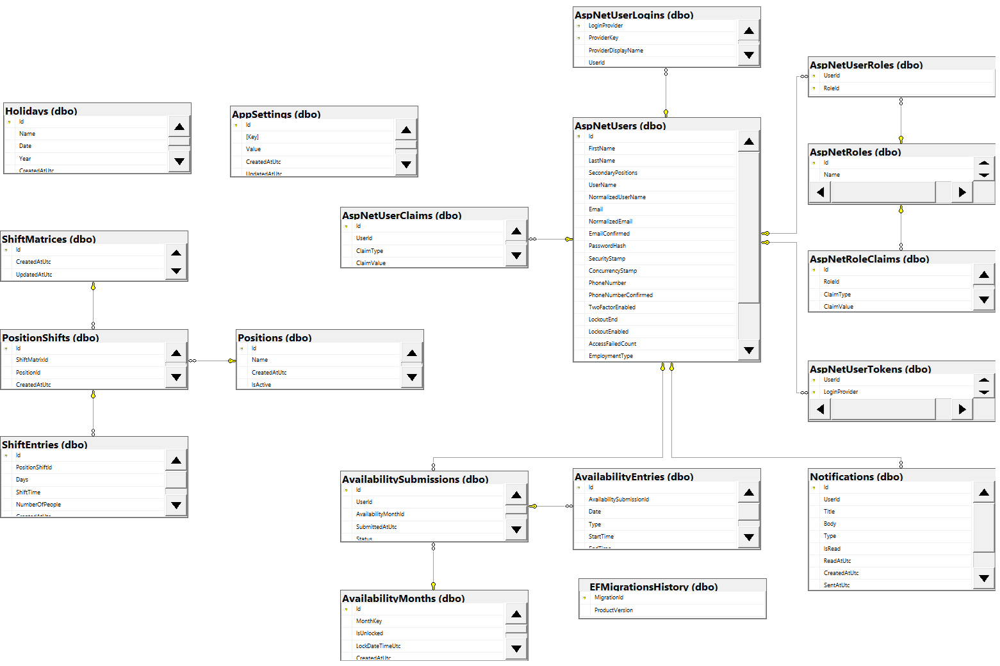

# AvailabilityCollector

### Seminarska naloga pri predmetu Informacijski sistemi  
Univerza v Ljubljani, Fakulteta za računalništvo in informatiko

---

## 👥 Avtorji

- **Matej Bokal** — 63200465  
- **Jožef Gabrijel Avsec** — 63220010

---

## 📋 Opis delovanja celotnega sistema

**AvailabilityCollector** je informacijski sistem za zbiranje, obdelavo in prikazovanje razpoložljivosti delavcev v okoljih z izmenskim delom. Sistem je sestavljen iz treh glavnih komponent:

### 🔵 Spletna aplikacija (ASP.NET Core MVC)
Spletna aplikacija omogoča upravljanje sistema preko spletnega brskalnika. Podpira:
- **Registracijo in prijavo** uporabnikov preko ASP.NET Core Identity
- **Administratorski vmesnik** za upravljanje mesečnih obdobij, nastavitev sistema, pregledovanje oddanih razpoložljivosti in upravljanje uporabnikov
- **Delavčev vmesnik** za oddajo razpoložljivosti preko spletnega brskalnika
- **Dinamične tabele** za prikaz razpoložljivosti vseh delavcev
- **Sistem obvestil** za opomnike o oddajanju razpoložljivosti

### 🟢 REST API storitev (.NET Web API)
API je integriran v isto ASP.NET Core aplikacijo in je dostopen preko prefixa `/api/`. Omogoča:
- **JWT avtentikacijo** za varno dostopanje do API-ja
- **CRUD operacije** za razpoložljivosti (Create, Read, Update, Delete)
- **Avtorizacijo** preko vlog (Worker, Admin)
- **Swagger dokumentacijo** na `/swagger` za pregled in testiranje vseh endpointov
- **JSON komunikacijo** z odjemalci

API podpira naslednje glavne skupine endpointov:
- `/api/auth` — avtentikacija (login, register)
- `/api/availability/my` — razpoložljivosti uporabnika (GET, POST, PUT, DELETE)
- `/api/months` — upravljanje mesečnih obdobij (GET unlocked months, POST unlock)
- `/api/settings` — nastavitve sistema

### 🟡 Android mobilna aplikacija
Mobilna aplikacija omogoča delavcem oddajo razpoložljivosti neposredno iz mobilne naprave:
- **Prijavo in registracijo** preko API-ja z JWT tokenjem
- **Pregled odklepanih mesečnih obdobij** za oddajo razpoložljivosti
- **Oddajo razpoložljivosti** (Create operacija) preko API-ja z uporabo Volley knjižnice
- **Pregled že oddanih razpoložljivosti** (Read operacija) za vsak mesec
- **Interaktiven koledarski vmesnik** za označevanje razpoložljivosti po dneh
- **Podporo za različne tipe razpoložljivosti**: nedostopen, cel dan, časovni razpon

Aplikacija uporablja **Volley** knjižnico za HTTP zahtevke in **JWT tokenje** za avtentikacijo pri vseh API kliceh (razen prijave in registracije).

### 🔄 Delovanje sistema
1. **Administrator** odklene mesec za oddajo razpoložljivosti preko spletne aplikacije ali API-ja
2. **Delavec** se prijavi v sistem (spletno ali mobilno aplikacijo) in vidi odklepane mesece
3. **Delavec** oddajo razpoložljivosti za izbrani mesec z označevanjem posameznih dni (nedostopen, cel dan, časovni razpon)
4. **Sistem** validira podatke (npr. minimalna dolžina časovnega razpona, dovoljeni časovni okvir)
5. **Administrator** pregleduje oddane razpoložljivosti in na podlagi njih sestavlja urnik

---

## 🌐 Dostop do aplikacije

Aplikacija je javno dostopna na naslednjih naslovih:

- **Spletna aplikacija:** [https://availabilityapp-api-ascabgdzc2cvb7aw.italynorth-01.azurewebsites.net/](https://availabilityapp-api-ascabgdzc2cvb7aw.italynorth-01.azurewebsites.net/)
- **REST API:** [https://availabilityapp-api-ascabgdzc2cvb7aw.italynorth-01.azurewebsites.net/api/](https://availabilityapp-api-ascabgdzc2cvb7aw.italynorth-01.azurewebsites.net/api/)
- **Swagger UI dokumentacija:** [https://availabilityapp-api-ascabgdzc2cvb7aw.italynorth-01.azurewebsites.net/swagger](https://availabilityapp-api-ascabgdzc2cvb7aw.italynorth-01.azurewebsites.net/swagger)

> **Opomba:** API je integriran v isto ASP.NET Core aplikacijo in je dostopen preko prefixa `/api/`. Swagger UI omogoča interaktivno testiranje in pregled vseh API endpointov.

### Testni dostopni podatki

Za testiranje aplikacije lahko uporabite naslednje testne uporabniške račune:

**Administrator:**
- **Email:** `matej@bokal.si`
- **Geslo:** `Matej123.`

**Delavec (Worker):**
- **Email:** `gabrijel@avsec.si`
- **Geslo:** `Gabrijel123.`

> **Opomba:** Administrator ima dostop do vseh funkcionalnosti sistema, vključno z upravljanjem mesečnih obdobij, nastavitev in pregledom razpoložljivosti vseh delavcev. Delavec lahko oddaja in pregleduje le svojo razpoložljivost.

---

## 📸 Zaslonske slike grafičnega vmesnika

### Spletna aplikacija

#### Administratorski dashboard

#### Tabela razpoložljivosti delavcev

#### Sistem obveščanja

### Mobilna aplikacija (Android)

#### Glavni zaslon

#### Kalendar za oddajo razpoložljivosti

---

## 👨‍💻 Opis nalog, ki jih je izvedel vsak izmed študentov

### Jožef Gabrijel Avsec (63220010)
- **Začetna Android aplikacija** — osnovna struktura, gradle konfiguracija, pogledi in styling

### Matej Bokal (63200465)
- **Razvoj spletne aplikacije**
- **Razvoj REST API storitve** — implementacija API endpointov z JWT avtentikacijo
- **Azure deployment** — aplikacija in baza
- **Izdelava README.md**
- **Razširitve in optimizacije Android aplikacije** — dopolnitve in izboljšave, dokončal vso funkcionalnost

---

## 🗄️ Podatkovni model podatkovne baze

### Diagram podatkovnega modela

*Diagram prikazuje strukturo podatkovne baze z vsemi tabelami in njihovimi relacijami. Generiran z SQL Server Management Studio.*

### Opis podatkovnega modela

Podatkovna baza vsebuje naslednje glavne entitete:

#### Identiteta in uporabniki (ASP.NET Core Identity)
- **AspNetUsers** — uporabniki sistema (delavci in administratorji)
- **AspNetRoles** — vloge (Worker, Admin)
- **AspNetUserRoles** — povezava uporabnikov in vlog

#### Domenski podatki
- **AvailabilityMonths** — mesečna obdobja za oddajo razpoložljivosti (MonthKey, IsUnlocked, LockDateTimeUtc)
- **AvailabilitySubmissions** — oddane razpoložljivosti (povezana z uporabnikom in mesečnim obdobjem)
- **AvailabilityEntries** — posamezni vnosi razpoložljivosti za določen dan (tip: Unavailable, FullDay, TimeRange; časovni razponi)
- **Positions** — delovna mesta/pozicije
- **Holidays** — prazniki in posebni dnevi
- **ShiftMatrices** — izmenske matrice za različna obdobja
- **PositionShifts** — povezava pozicij in izmen znotraj matrike
- **ShiftEntries** — posamezni vnosi izmen
- **AppSettings** — nastavitve sistema (minimalna dolžina časovnega razpona, dovoljeni časovni okvir, itd.)
- **Notifications** — obvestila za uporabnike

#### Relacije
- Vsaka **AvailabilitySubmission** pripada enemu uporabniku (AspNetUsers) in enemu **AvailabilityMonth**
- Vsaka **AvailabilitySubmission** ima več **AvailabilityEntries** (ena za vsak dan)
- **ShiftMatrix** vsebuje več **PositionShifts**, ki so povezani z **Position**
- Vsak **PositionShift** ima več **ShiftEntries**

---

## 🏗️ Tehnologije

- **Spletna aplikacija in API:** ASP.NET Core MVC (.NET 10), ASP.NET Core Identity, Entity Framework Core
- **Podatkovna baza:** Microsoft SQL Server (Docker lokalno, Azure SQL v produkciji)
- **Android aplikacija:** Kotlin, Jetpack Compose, Volley
- **Avtentikacija:** JWT Bearer tokens
- **API dokumentacija:** Swagger/OpenAPI
